```{r, include = FALSE}
knitr::opts_chunk$set(
  collapse = TRUE,
  comment = "#>"
)
```

# Git intro

Assuming you are on Windows, install Git from [here](https://git-scm.com/downloads/win)
(if you don’t know whether it’s the 32 or 64 bits version, you most likely need the 
64 bit one). You should have something called ‘Git Bash’ installed. You can open 
Git Bash inside a specific folder by right-clicking your folder and selecting 
‘Open Git Bash here’, or you may want to learn some basic commands to navigate 
from the command line itself (from now on, __writing <> is not part of the command__,
I just use it as a __placeholder__ for what you need to write there):

- Print your current directory:
```
pwd
```
- List files from your current directory:
```
ls
```
- Move to another directory relative to the one you are in right now:
```
cd <relative_path_where_to_move>
```

We assume here that the repository you want to contribute to already exists. 
You can go to its page in Github and copy the URL as seen in the image below:

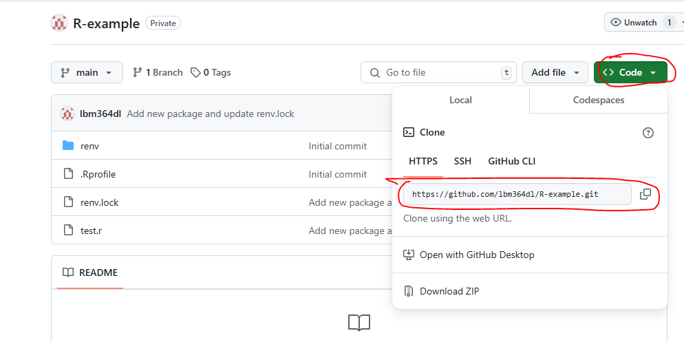
 
We can clone it using the command 
```
git clone <url_you_copied>`
```

This is called cloning via HTTPS. You should be asked to introduce your Github 
credentials. You can also clone via SSH which is more secure in the sense that 
it won’t ask you to sign in, but if you know that you probably don’t need this 
guide.

Now a new directory should have been created with the content of the repository 
in your local file system. From now on we will see the basic git commands that 
you would need in daily usage. We assume you are inside the repository. We 
explain them with an example.

Suppose you want to start contributing to this repository. A good practice 
(and one that we will enforce to use) is to make your own code changes in a 
‘different place’ than the ones you currently see in the repository. The things 
you see now are in what it’s called the ‘main branch’, and you will make your 
code changes in a ‘new branch’, which will start with the same content as the 
main one, but will then evolve with different changes. If you haven’t done 
anything yet, you should be in the main branch (maybe it’s called ‘main’ or 
‘master’, these are just conventions). You can use the command ‘git status’ 
to check this:
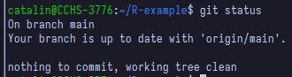

Your local version of a repository does not need to match the remote version 
(the one we store in Github in this case), but before you start your work on 
a new branch, you should keep your main branch up to date in case someone 
added new code since the last time you checked. We get remote changes to local 
by using the command ‘git pull’: 
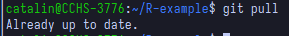

In this case I already had all the remote changes, but the message will be 
different if you had missing changes. Now we are ready to create our own 
‘branch’, from which we will start working on new code.
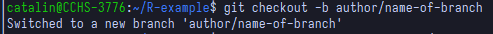
 
The command ‘git checkout <name-of-branch>’ is used to change from one branch
to another (so that you will now see the files and changes that are in that
branch). Additionally, if we add the ‘-b’ option, it will create the branch with
the given name if it doesn’t already exist, which is our case in this example.

Some common practices for naming your branches (that we should follow):

- They do not contain caps (all lowercase)
- Words are separated with dashes (-)
- The name includes the author and some descriptive name separated by a slash (/)

If Ermenegildo wants to create some code for preprocessing bilateral trade data,
an acceptable branch name could be ‘ermenegildo/preprocess-bilateral-trade-data’.

Now you are in your own branch and you can start working on your changes. While 
you work on them, you should keep track of changes with git. We can add all 
changes using ‘git add .’, where the dot means ‘this directory’, or we can add 
a specific file with ‘git add <relative_name_of_file>’
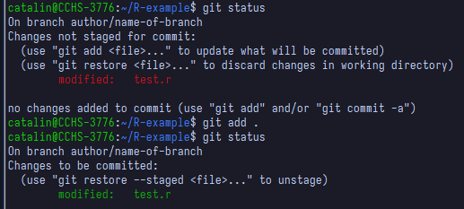

After adding our changes, we must ‘commit’ them. This commit step is what actually 
saves your changes in the git history. You do this with the command 
`git commit -m ‘Some descriptive message for your changes’`
A common practice for commit messages is to start them with a verb in infinitive 
(imperative style), indicating an action that was performed, e.g., 
‘Create tests for bilateral trade data preprocessing’.  
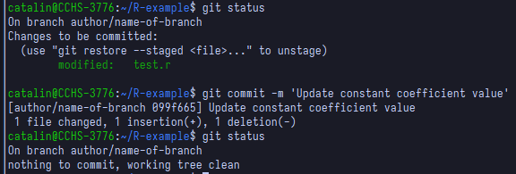

A common practice is to make small commits, that is, include just a few changes 
in each commit, so that it is easier to keep track of your work’s history, instead 
of just having a single commit when you are done with everything. Ultimately, the 
amount of commits is your decision, but should not be just one commit per branch.

After committing, we now have our changes in local git history, but we should 
probably also add them to the remote Github repository. We do this using the command
`git push origin <name-of-branch>`
Now you should be able to see your changes in your own branch from Github.

Suppose you are done with your changes and you want to add these to the main 
branch. Mixing one branch with another is known as ‘merging’. In this case we would 
like to merge our new branch with the main branch. This can be done forcefully, but 
the common practice we will be following is to create what is known as a ‘Pull 
request’ from our branch into the main one, and we do this directly from Github.
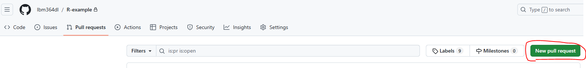
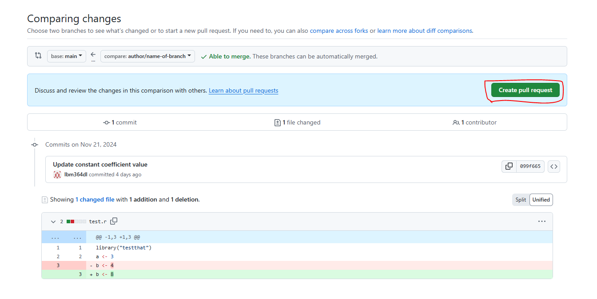

Here you can see all the changes you made (that differ from the main branch) before
clicking again ‘Create pull request’. Then you will see the following, where you
should add some title and description to explain what you have done. You finally
click ‘Create pull request’.
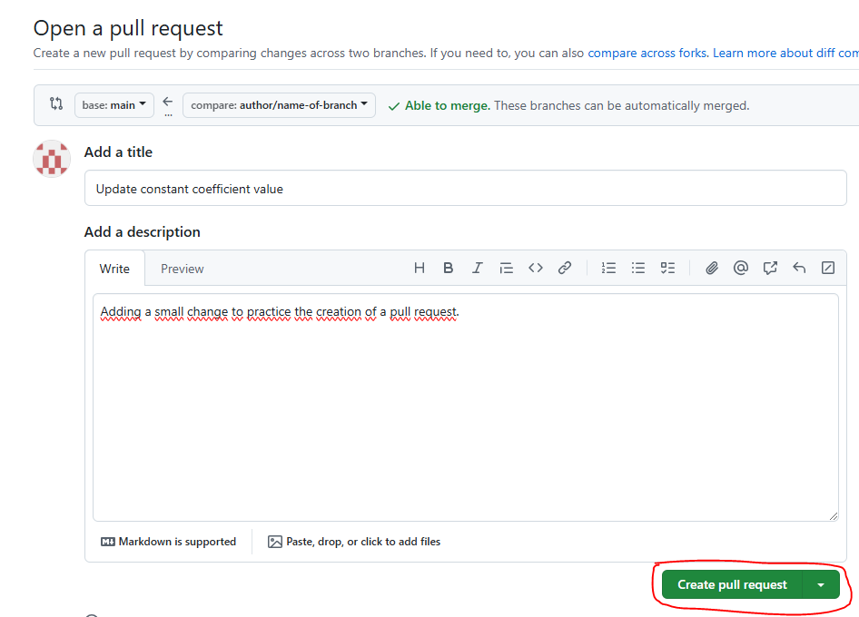

Now the Pull Request (often abbreviated as PR) is created and the next step is to
ask for someone’s review. 
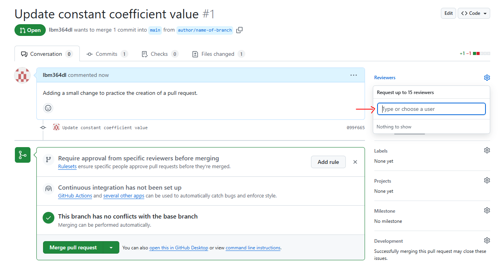

Ideally these changes would not be merged until someone else reviews your code.
This person might find things you have to change and request these changes before
merging, so you would have to keep working on your branch until they are satisfied.
Then they would accept your changes and you would be ready to merge your changes
into the main branch, and the process would be done.

While working on your own branch, others may have merged their own branches
into the main branch and then your own branch would be outdated. When creating
a Pull Request yourself, you should make sure your branch is also up to date with
everything already on the main branch. We do this with the command 
`git pull origin main`

The previous command will try to automatically merge new changes from the main
branch into yours. This automatic merge works most of the times, but sometimes
you may find conflicts. If this happens, you should manually check which parts
of the code should be kept. You can ask others for help at this point.


# Using virtual environments with renv package in R

For a new project or one not using renv yet, open an R shell in the root
directory of your project and run inside the shell: 
`renv::init()`
It will probably ask to close and reopen a clean shell. After that, every
time we open an R shell inside our project, it will automatically use renv
whenever we want to install new packages. For example, we can install a
testing package with
`install.packages(“testthat”)`
and this will not be a global installation, which means it will only work
inside this project. This is a way of isolating your project dependencies
and making your projects reproducible, by letting others know exactly
which packages your code needs to run, and not add unnecessary ones
that you may have because of other projects.
There is a file called `renv.lock` which stores information about the
required packages and their versions. After installing new packages,
it is not updated automatically and we have to do it manually by running
`renv::snapshot()`
This will update the `renv.lock` file. If someone else wants to reproduce
your code, they may have to run
`renv::restore()`
which will install any packages from `renv.lock` that they may still not
have installed. If you use Github with others, then you might also need to
do this every time you pull remote changes and someone else has included a
new package, so that you are then up to date with them. In any case, when
opening the R shell, it will probably remind you with a message:
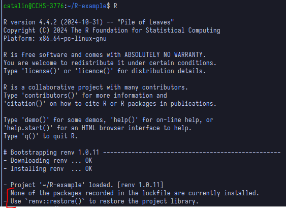

[renv source](https://rstudio.github.io/renv/articles/renv.html#getting-started)

# R code style and formatting

There are some conventions and good practice for how to write neat code
in R (see e.g. [this](http://adv-r.had.co.nz/Style.html)). While it is nice to
know them, most of them can be automatically applied using some formatting tool.
There should be something like that in RStudio (I don’t use it so I’m not sure)
or in other editors. It is good to try to make one of these autoformatters work
on your code because at some point I will try to add a formatting check on
Github in order not to allow pull requests being approved if they don’t follow
these conventions, and it’s way more tedious to try to check them manually.
